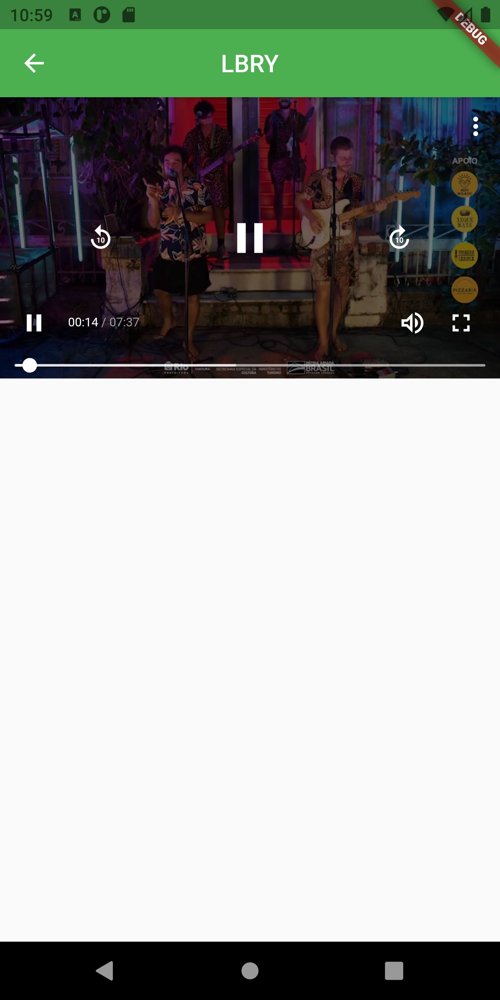
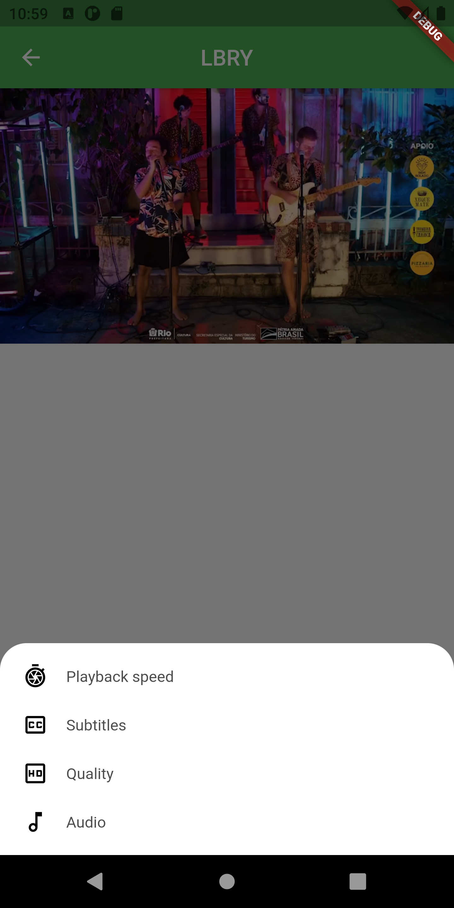
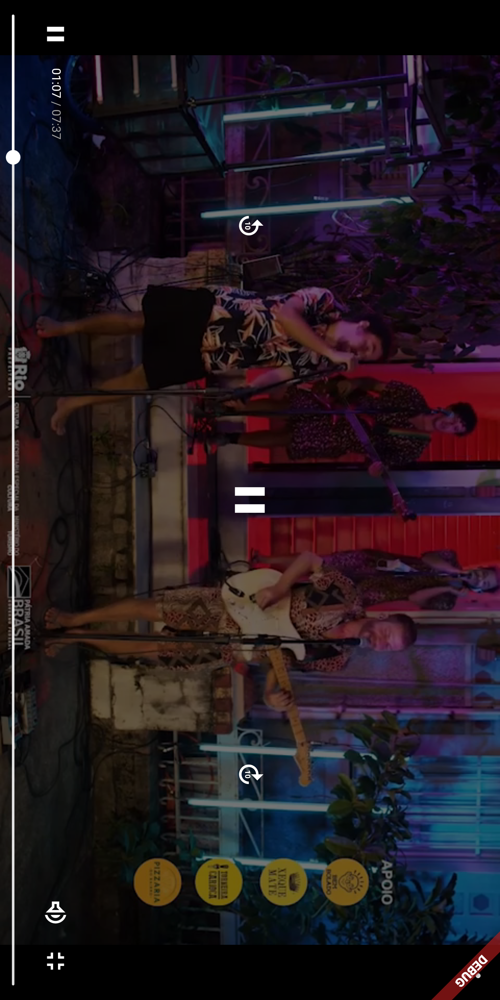

# A browser for LBRY protocol built using Flutter
### Demo
[Watch Demo](https://odysee.com/@skywalker:7/lbry-flutter-app-demo1:3)

The `lbry_lite` branch uses [odysee's](https://odysee.com) API backend instead of running `lbrynet` locally which
should make the client lightweight

### Screenshots

\